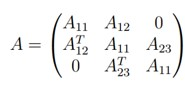

# Numerical_Methods_Project2
Solving a system of linear equations Ax = b using the block SOR method, where the matrix A(n x n) is of the form:    
 <!-- -->   
where Ai,j(p x p) and n = 3p. We assume that A1,1 is symmetric and positively defined.
We will use the Cholesky-Banachiewicz (LDLT) method to solve appropriate systems of linear equations.
We will additionally determine the spectral radius of the iteration matrix for the block SOR method.

The project consists of a matlab code and a report.   
Authors:  
Julia Kaznowska  
Piotr Wilczyński
